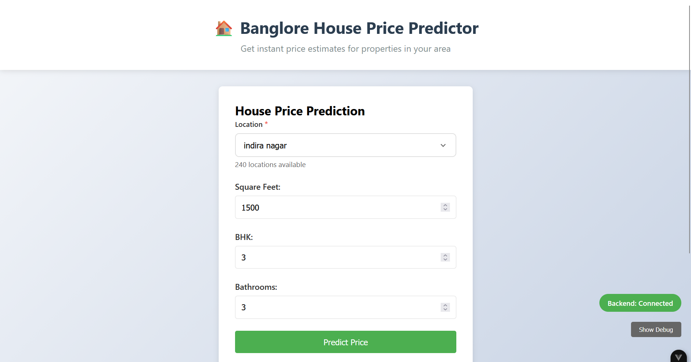

# 🏠 House Price Prediction - ML Full Stack Application

[](your-live-link)
[](https://python.org)
[](https://fastapi.tiangolo.com)
[](https://vuejs.org)
[](LICENSE)

A  machine learning application that predicts house prices in Bangalore based on location, area(sqft), bedrooms, and bathrooms.

## ✨ Features
### **DataSet Used**
- (https://www.kaggle.com/code/mfaisalqureshi/banglore-house-price-prediction)

### 🤖 **Machine Learning Backend**
- **Scikit-learn** model trained on Bangalore house price data
- **Linear Regression** for accurate price predictions
- **Feature engineering** for location-based pricing
- **FastAPI** REST API with automatic documentation

### 🎨 **Modern Frontend**
- **Vue.js 3** with Composition API
- **Professional search** with fuzzy matching
- **Indian price formatting** (Lakhs/Crores)
- **Real-time predictions** with instant results
- **Responsive design** for all devices

### 🔍 **Smart Location Search**
- YouTube-style searchable dropdown
- Fuzzy matching with abbreviations
- Recent searches memory
- Keyboard navigation support
- Highlighted search results

## 📸 Screenshots

### 🏠 Prediction Interface


### 📊 Results Display


### 🔍 Smart Search


## 🚀 Quick Start

### Prerequisites
- Python 3.9+
- Node.js 16+
- Git

### Backend Setup
```bash
# Clone repository
git clone https://github.com/ddarkns/house-price-predictor.git

# Install dependencies
pip install -r requirements.txt


#open two terminals , one for backend one for forntend

# Run backend
uvicorn backend.main:app --reload

# Run frontend
cd frontend
npm run dev
